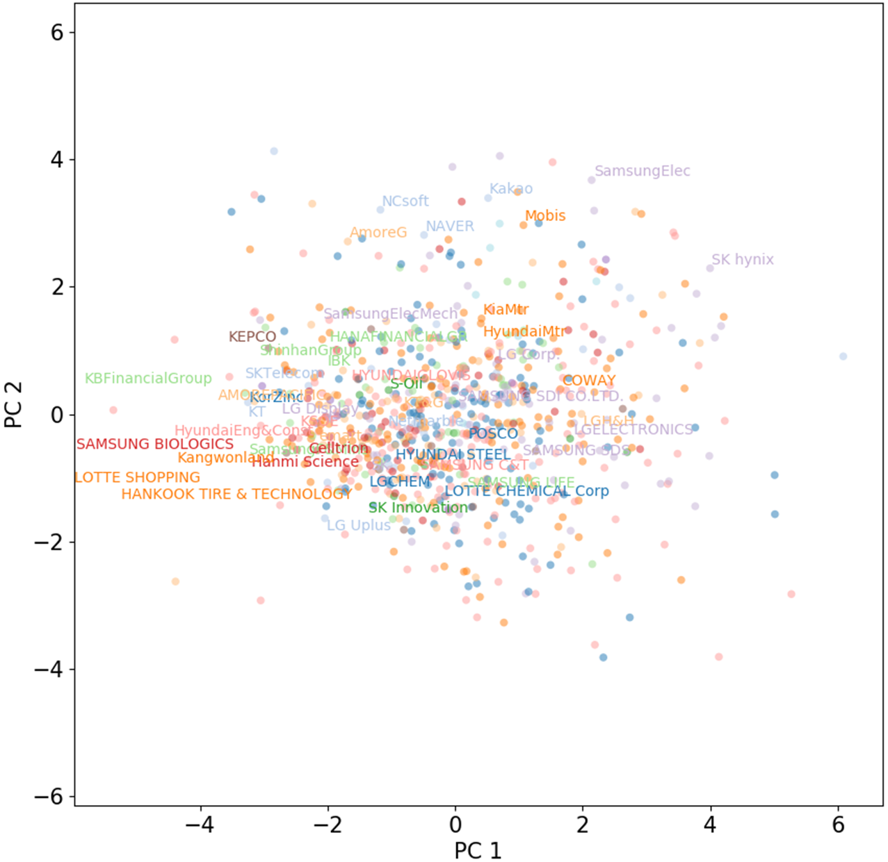
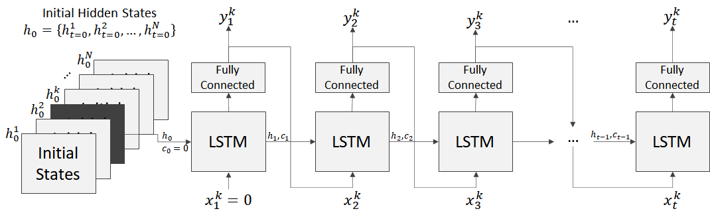

# Modeling Financial Time Series using LSTM with Trainable Initial Hidden States




This is the PyTorch implementation of **"Modeling Financial Time Series using LSTM with Trainable Initial Hidden States"** [[arXiv]](https://arxiv.org/abs/2007.06848). 


## Quick How-to

### Requirements

This code was tested on an Ubuntu 18.04 system using PyTorch 1.5. See `requirements.txt` for the packages used in our conda environment (you probably won't need all of them, though).


### Training a New Model

This repository contains the code and the dataset required for training. You can train a model using:

```bash
python lstm-initStates.py train
```

When the training completes, it saves the model parameters as `model_best.tar` in `result` directory.


### Check the Training Results

After training, you can get the model's initial hidden states and output using:

```bash
python lstm-initStates.py eval
```

It saves the results in `result` directory:

- **initial hidden states**: `initStates_from_best.txt`. It has N x M values where N is the number of sequences in the dataset and M is the number of initial hidden states (= number of LSTM cells). 
- **model's output**:  `predict_idxSeq_%d.txt/png` for. This is the stock price change relative to the price of the first day (2019-01-01).

For convenience, the trained model is provided with the code (`model_best.tar` in `result` directory).


### Data

The stock prices of the companies listed in Korea Composite Stock Price Index (KOSPI) from Jan 1st to Dec 31st, 2019 were used. The moving average filter with the window length of five days were applied to the adjusted closing price and some stocks with missing values were excluded. As a result, a total number of 735 stocks were used in our dataset. See `kospi_listed_inKorean.csv` for reference (in Korean). 

In data directory, there are 3 directories:

- 2019-01-01_2019-03-31: the '**short**' dataset for comparison
- 2019-01-01_2019-06-30: the '**long**' dataset for comparison
- 2019-01-01_2019-12-31: the dataset used in our **main experiment**

In each directory, stock prices are stored as a separate file for each company. See `myDataloader.py` for details on reading those files.


### Architecture



In this model, the initial (t=0) hidden states of LSTM `h0`are trained separately for each sequence. The model can reconstruct different sequences from the different initial hidden states without any external input. Consequently, the initial hidden states play a key role in capturing differences between the time series data.  For details on the model and data, please see "[**Modeling Financial Time Series using LSTM with Trainable Initial Hidden States**](https://arxiv.org/abs/2007.06848)".


## Citation	

If you find this code useful, please consider citing our work:

```
@inproceedings{hwang2020modeling,
Author = {Hwang, Jungsik},
Title = {Modeling Financial Time Series using LSTM with Trainable Initial Hidden States},
Booktitle  = {arXiv preprint arXiv:2007.06848},
Year = {2020}
}
```

